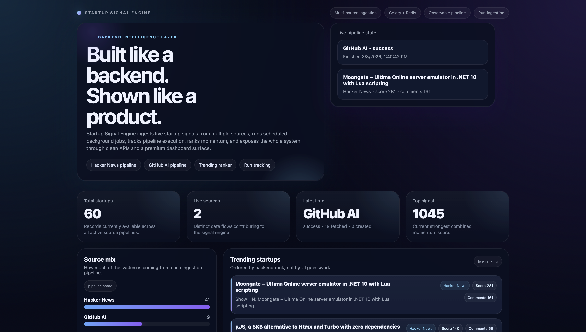
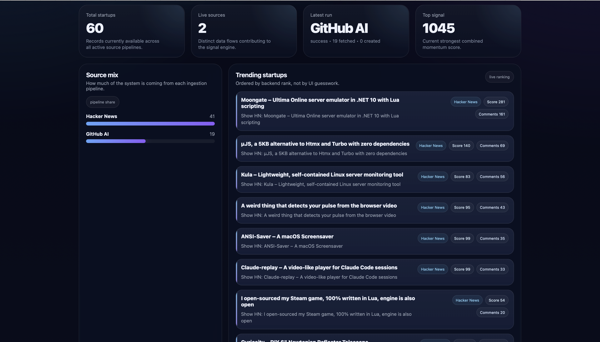
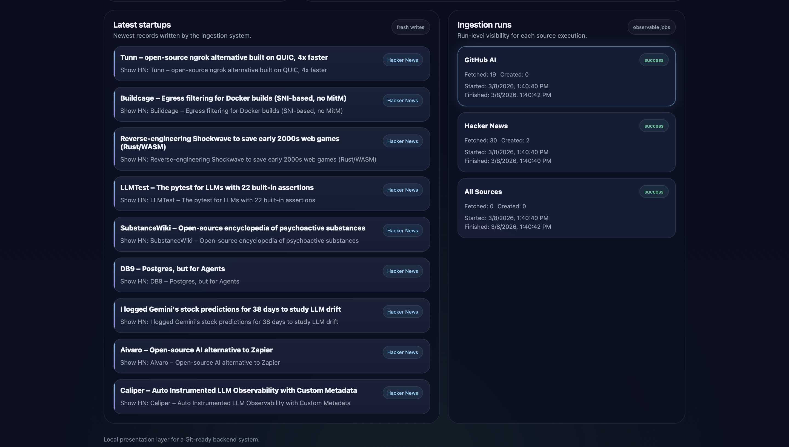
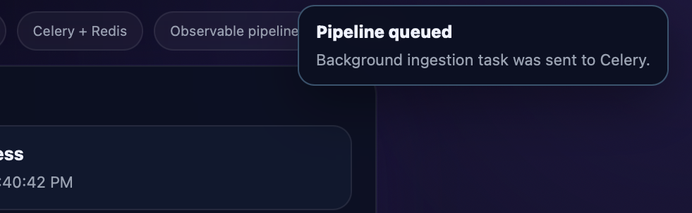
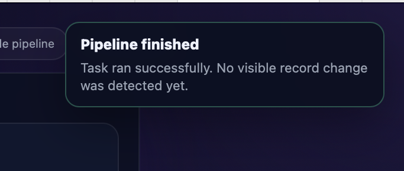
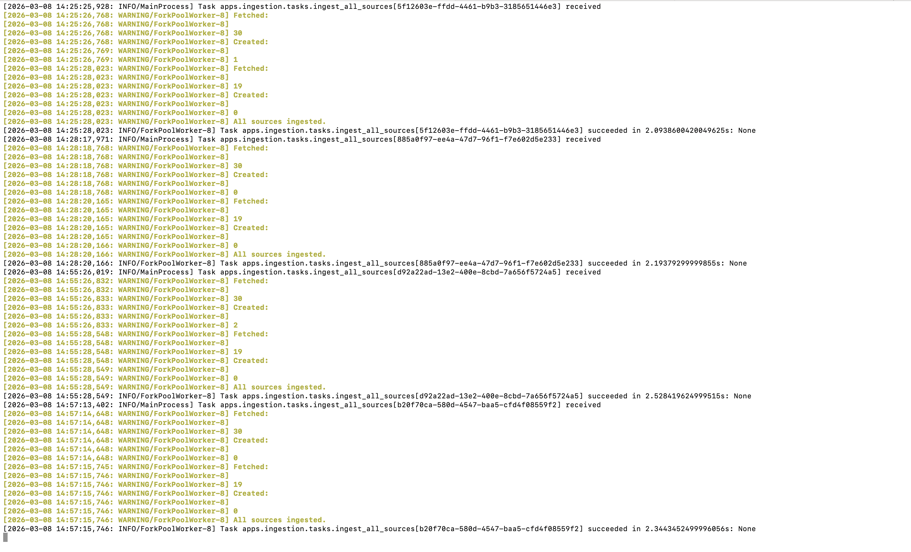

# Startup Signal Engine

A backend-focused project that collects startup signals from different sources, processes them with background workers, and exposes the data through clean APIs and a visual dashboard.

The goal of this project is simple: show how a backend system that ingests external data, runs async jobs, and exposes structured APIs can be built and observed.

Instead of just building endpoints, this project focuses on the **full backend flow**: ingestion → processing → storage → analytics → UI visibility.

---

Main dashboard

⸻

Trending signals

Startups ranked by the backend scoring logic.

⸻

Latest records and ingestion runs

The dashboard also exposes the latest database writes and pipeline execution metadata.

⸻

Pipeline execution feedback

When a pipeline is triggered from the UI, the request is sent to Celery and the user receives feedback about the execution state.

Pipeline queued

Pipeline finished

⸻

Background workers

The ingestion jobs run asynchronously using Celery workers with Redis as the message broker.

This allows the system to process external sources without blocking the web server.

Example worker execution:

# What this project does

Startup Signal Engine pulls startup-related signals from multiple sources and turns them into a structured backend system.

At the moment the system ingests:

- Hacker News Show HN
- GitHub AI related repositories

The data is stored in the database and processed to generate:

- trending startups
- source distribution
- analytics summary
- ingestion run history

Everything is exposed through a REST API and a small dashboard that visualizes what the backend is doing.

---

# Tech stack

Python  
Django  
Django REST Framework  
Celery  
Redis  
SQLite (for local development)

Frontend layer is intentionally minimal:

HTML  
CSS  
Vanilla JavaScript

The dashboard exists mainly to **make backend behavior visible**.

---

# System architecture

The project is built around a simple pipeline:

External sources
↓
Ingestion services
↓
Celery background workers
↓
Database
↓
Analytics layer
↓
API
↓
Dashboard

Each ingestion run is tracked so the system always knows:

- when a pipeline started
- when it finished
- how many items were fetched
- how many records were created
- if any errors occurred

---

# Main API endpoints

GET  /api/startups/
GET  /api/startups/trending/
GET  /api/startups/?source=hn
GET  /api/startups/?source=ph
GET  /api/startups/?search=ai

GET  /api/analytics/summary/
GET  /api/analytics/ingestion-status/

POST /api/ingestion/run/

These endpoints power the dashboard and allow the backend to be inspected directly.

---

# Dashboard

A simple visual layer was added to show what the backend is doing in real time.

The dashboard shows:

- total startups collected
- active data sources
- latest ingestion run
- top ranked startup signal
- source distribution
- trending startups
- latest collected startups
- ingestion job history

Route:

/

### Dashboard template

Add screenshot here:

[ dashboard-screenshot.png ]

---

# Background processing

The ingestion pipeline runs using **Celery workers** and **Redis** as the message broker.

This allows the system to:

- fetch data asynchronously
- run scheduled ingestion jobs
- trigger manual ingestion runs
- track execution results

### Celery + Redis running

Add screenshot here:

[ celery-redis-running.png ]

---

# Running locally

Clone the repository

git clone 
cd startup-signal-engine

Create virtual environment

python3 -m venv .venv
source .venv/bin/activate

Install dependencies

pip install -r requirements.txt

Run database migrations

python manage.py migrate

Start Redis

redis-server

Run Django server

python manage.py runserver

Start Celery worker

celery -A config worker -l info

(Optional) run scheduled jobs

celery -A config beat -l info

Initial ingestion

python manage.py ingest_all

---

# Why this project exists

This project is meant to demonstrate backend engineering beyond basic CRUD APIs.

It focuses on:

- ingestion pipelines
- async background processing
- job tracking
- ranking logic
- API design
- backend observability

The dashboard exists only to make those backend processes visible.

---

# Possible future improvements

Some obvious directions if this system were expanded:

- more ingestion sources
- stronger ranking logic
- better signal classification
- scheduled analytics jobs
- production deployment
- frontend visualization improvements

---

# Notes

This repository focuses on **backend architecture and data flow** rather than frontend polish.

The UI is intentionally lightweight and exists only to expose the behavior of the backend system.

